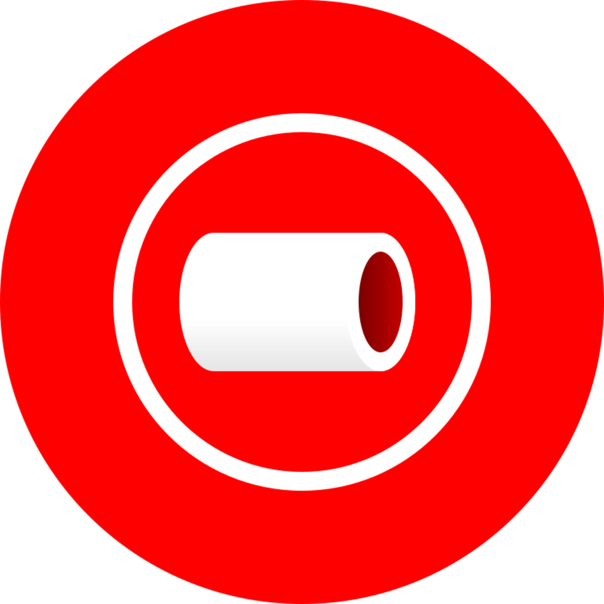
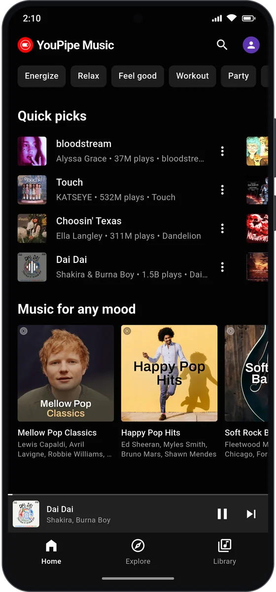
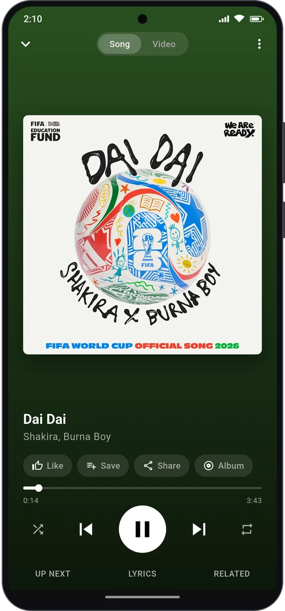
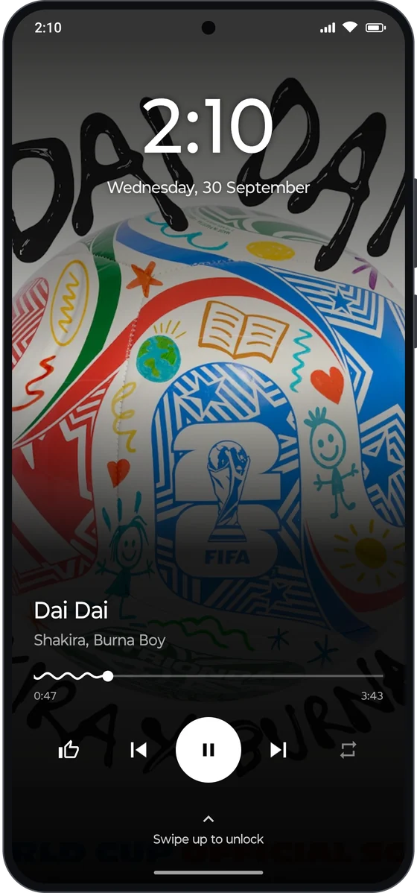
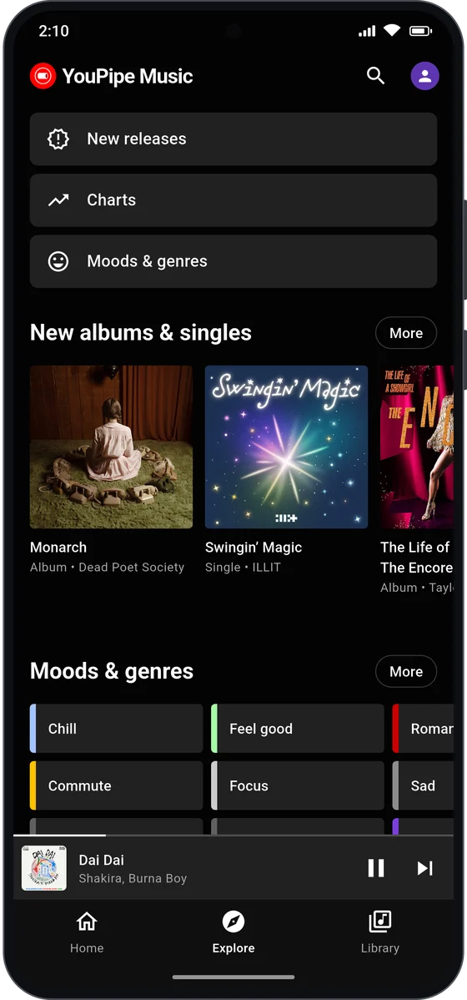
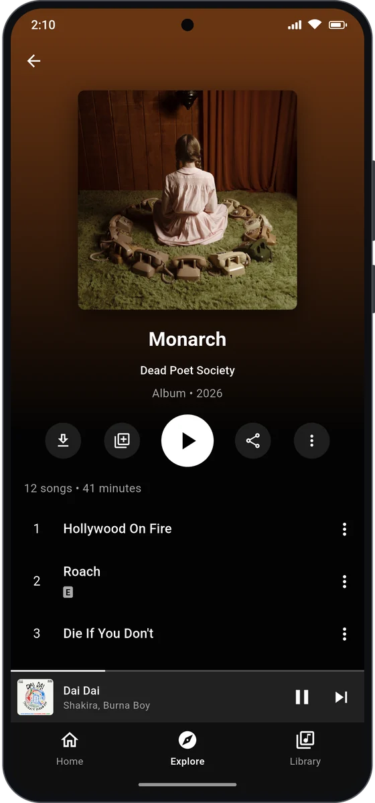
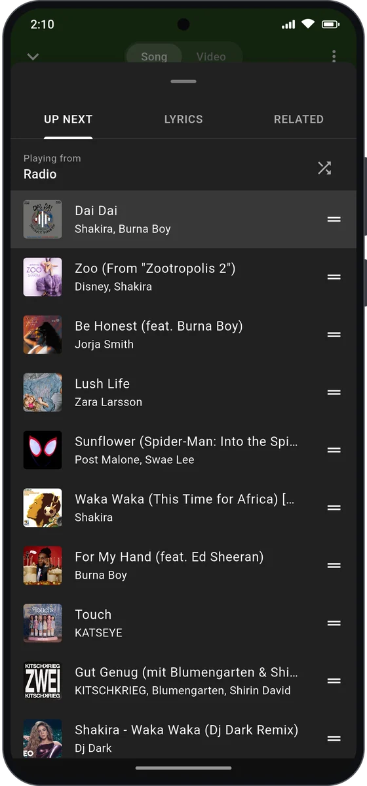

<div align="center">



# YouPipe Music

**Your music, without the ads.**<br/>
A free, ad-free YouTube Music client for Android, with background playback, offline downloads and synced lyrics.

[](https://github.com/SanuSanal/YouPipe-Music/releases/latest)
[](https://github.com/SanuSanal/YouPipe-Music/releases)
[](#-download)
[](https://flutter.dev)

<a href="https://github.com/SanuSanal/YouPipe-Music/releases/latest">
  
</a>
<a href="https://sanusanal.github.io/YouPipe-Music/">
  
</a>

</div>

---

## 📸 Screenshots

<table align="center">
  <tr>
    <td align="center"><br/><sub><b>Home</b></sub></td>
    <td align="center"><br/><sub><b>Now playing</b></sub></td>
    <td align="center"><br/><sub><b>Lock screen player</b></sub></td>
  </tr>
  <tr>
    <td align="center"><br/><sub><b>Explore</b></sub></td>
    <td align="center"><br/><sub><b>Albums</b></sub></td>
    <td align="center"><br/><sub><b>Up next</b></sub></td>
  </tr>
</table>

---

## ✨ Features

**Listen**
- Everything from YouTube Music: songs, albums, artists, playlists, charts, moods and new releases
- **No ads**, ever
- Background playback with notification and lock-screen controls
- An optional full-screen **lock screen player**: the album art fills the screen, with a clock and big controls
- Endless radio and "Up next" from any song
- Shuffle, repeat and queue editing

**Look & feel**
- A familiar interface modelled on the YouTube Music app, so there's nothing new to learn
- Dark theme, with album and playlist pages tinted in colours taken from the artwork

**Lyrics**
- Synced, line-by-line lyrics (via [LRCLIB](https://lrclib.net)), with a fallback to YouTube Music lyrics

**Sound**
- Choose your audio quality
- Built-in equalizer and loudness boost
- Playback speed control
- Skip the non-music intros, skits and outros in music videos (via [SponsorBlock](https://sponsor.ajay.app))
- Sleep timer

**Offline & library**
- Download songs for offline listening
- Your own library on the device: liked songs, playlists, saved albums and listening history
- **Optional** sign-in to YouTube Music to bring in your account's library, likes and personal recommendations. Everything works without an account too

**In the car**
- Android Auto support

---

## 📥 Download

Grab the latest APK from the **[Releases page](https://github.com/SanuSanal/YouPipe-Music/releases/latest)** and install it on your phone.

> [!NOTE]
> YouPipe Music isn't on the Play Store. Android may ask you to allow installs from your browser or file manager the first time.

---

## 🔒 Privacy

- No ads, no trackers, no analytics.
- Your library, history and downloads stay on your device.
- Signing in is optional. You sign in on Google's own page, and YouPipe Music never sees your password.

---

## ❤️ Support the project

YouPipe Music is free and always will be. If it made your day a little better, you can buy me a coffee. Every bit helps keep the app alive and updated.

<p align="center">
  <a href="https://www.buymeacoffee.com/sanalm555k">
    
  </a>
  &nbsp;
  <a href="https://www.paypal.com/donate/?hosted_button_id=HBGNBZL5VRMTY">
    
  </a>
  &nbsp;
  <a href="https://revolut.me/sanalmyfyj">
    
  </a>
</p>

A ⭐ on this repo helps too!

---

## 🙏 Credits

YouPipe Music stands on the shoulders of these great open-source projects:

- [NewPipeExtractor](https://github.com/TeamNewPipe/NewPipeExtractor): audio streams
- [just_audio](https://pub.dev/packages/just_audio) and [audio_service](https://pub.dev/packages/audio_service): playback
- [LRCLIB](https://lrclib.net): synced lyrics
- [SponsorBlock](https://sponsor.ajay.app): skipping non-music segments
- [drift](https://pub.dev/packages/drift): the local library database

<details>
<summary><b>🛠️ For developers</b></summary>

<br/>

Browse, search and account features go through a pure-Dart client for YouTube Music's internal InnerTube API (`lib/innertube/`). Audio streams are resolved on Android by NewPipeExtractor. Playback runs on `just_audio` behind `audio_service`, and the library lives in SQLite via `drift`.

Architecture and design decisions are in [`docs/`](docs/README.md). Read [`AGENTS.md`](AGENTS.md) before contributing.

```
lib/innertube/   InnerTube client, models, parsers
lib/data/        stream resolver, drift database, library repository
lib/player/      audio handler (queue, radio, shuffle/repeat)
lib/features/    screens (home, explore, search, album, artist, playlist, library, player, settings)
lib/ui/          theme, router, shell, shared widgets
test/innertube/  parser tests against recorded fixtures + live API smoke tests
```

```bash
flutter pub get
dart run build_runner build --delete-conflicting-outputs   # drift code
flutter test                                              # parser tests (offline)
flutter test --tags live --run-skipped                    # hits the real API
flutter run
```

If YouTube changes break browsing, re-record fixtures and refresh the client version in `lib/innertube/clients.dart`. If playback breaks, bump the NewPipeExtractor version in `android/app/build.gradle.kts` first.

</details>

---

## ⚖️ Disclaimer

1. YouPipe Music is an unofficial app. It is not affiliated with, endorsed by or connected to YouTube, Google LLC or any of their subsidiaries.
2. All trademarks, and all music and content played in the app, belong to their respective owners.
3. The app uses YouTube's private API, which is against YouTube's Terms of Service. It is meant for personal use and is distributed outside the Play Store.
4. Use it at your own risk. The developer isn't responsible for any misuse or for issues arising from its use.

<div align="center">
<br/>
<sub>Made with ♥ for music lovers</sub>
</div>
